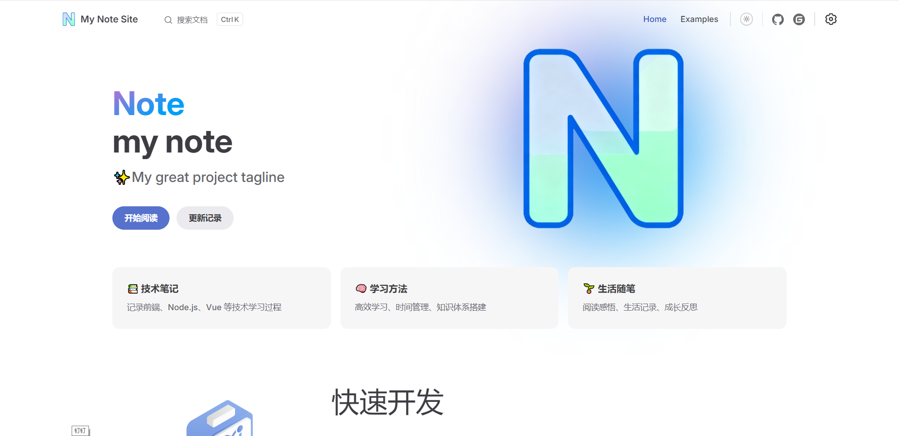
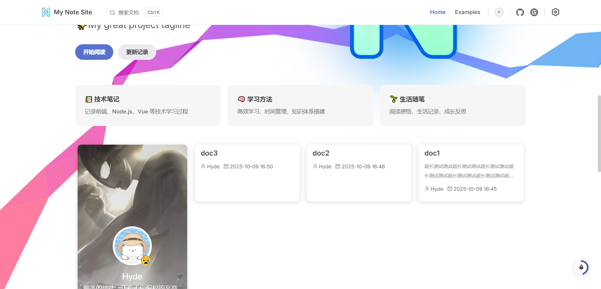

# Pulse Docs📝
一个基于Vitepress Theme Teek主题二次开发的博客/文档网站

# 特点✨

# 本地运行📦
### 安装依赖
```bash
npm install
```

### 启动
```bash
npm run docs:dev
```

### 预览
```bash
npm run docs:preview
```

### 打包
```bash
npm run docs:build
```

# 快速开始🚀
本项目已基于Vitepress Theme Teek主题二次封装，按照说明进行简单配置即可创建自己的博客/文档网站。

若需要更深层度的配置，请修改`/.vitepress/theme/config/teekConfig.ts`配置文件，配置项请查看[Teek文档](https://vp.teek.top/)

### 主题配置
二次封装后配置文件为`/.vitepress/siteConfig.ts`，可按照自己的需求进行配置

### 文件结构
markdown文件放在`/docs/[category]/xxx.md`, category为分类名称，如`/docs/guide/xxx.md`。

md文档会在项目启动时自动生成文档标题、分类名称、文件路由等基础信息，也可以手动修改，具体参考[文档]()

### 文档路由
文档路由与文件路径一致，如`/docs/guide/xxx.md`对应的路由为`/guide/xxx`，可以通过`/guide/xxx`访问该文档

### 图片资源
本项目默认将图片资源放在`/public/images`目录下，部署后会将public下资源移动到根目录下

在markdown文件中引用图片资源时，可直接只用绝对路径引用，如``

public下现有文件夹或者文件用途如下，也可自行修改：
- blog: 轮播图、博客背景图
- feature: 主页内容图片
- images: 图片资源
- login: 登录页图片
- screenshot: 系统截图
- 404.png: 404页面图片
- favicon.ico: 网站favicon
- logo.png: 网站logo

### 主页内容
主页内容是用于配置文档/博客首页内容的md文件，路径为`/docs/index.md`

配置项可以配置vitepress和teek主题的任何frontmatter属性

其中teek主题的frontmatter属性则会覆盖默认配置，具体可以Teek参考[文档](https://vp.teek.top/reference/frontmatter.html#%E9%A6%96%E9%A1%B5%E9%85%8D%E7%BD%AE)

### 功能页
根据teek主题默认提供4个功能页，可以直接作为路由配置访问，具体如下：

|  功能页   | 路由  |  文件路径  |
| :------: | :---: | :----: |
|  分类页   | /categories | /docs/@pages/categoriesPage.md |
|  标签页   | /tags | /docs/@pages/tagsPage.md |
|  归档页   | /archives | /docs/@pages/archivesPage.md |
| 文章清单页  | /articleOverview |  /docs/@pages/articleOverviewPage.md |
| 风险提示页  | /risk-link | /docs/@pages/riskLinkPage.md |
|  登录页   | /login | /docs/@pages/loginPage.md |

# 系统截图🖼️
### 文档风格


### 博客风格


### 博客大图


### 博客全图


### 博客卡片

